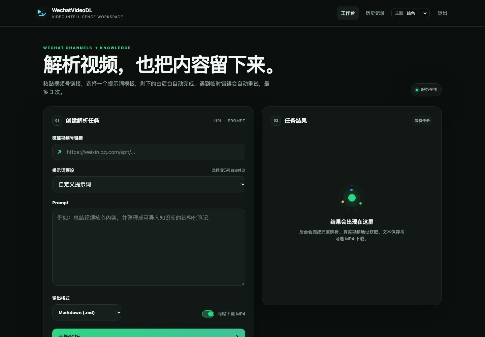
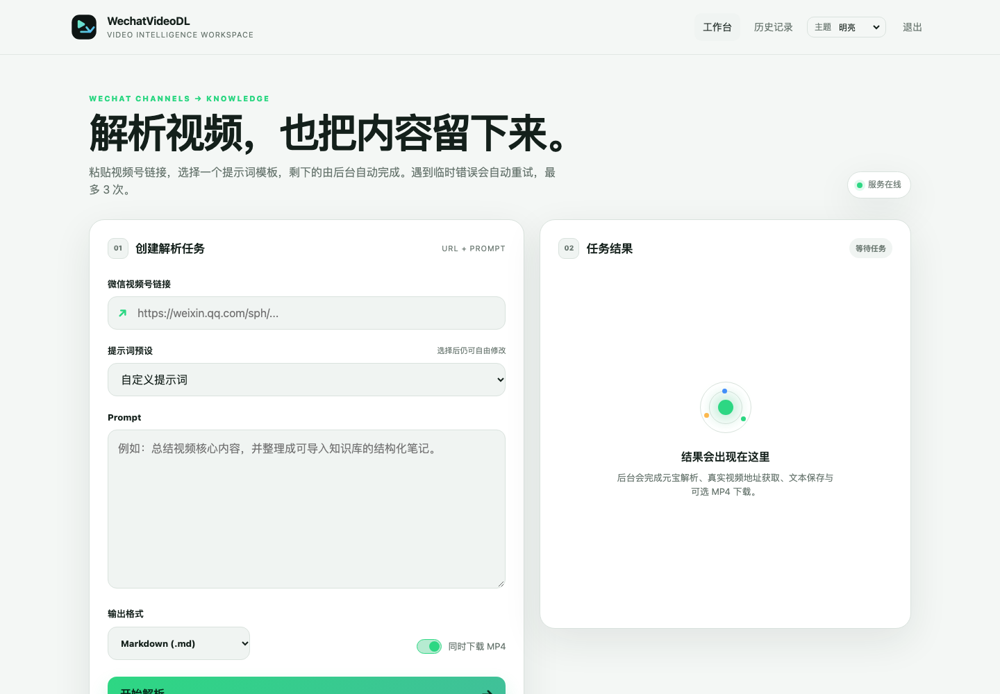
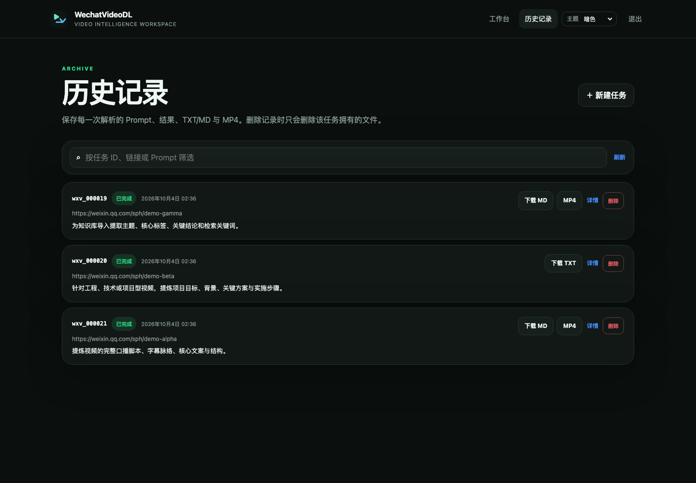

<div align="center">
  
  <h1>WechatVideoDL</h1>
  <p><strong>微信视频号解析、下载与 AI 内容提炼工作台</strong></p>
  <p>WeChat Channels URL → Tencent Yuanbao → Browserless Headless Chromium → MP4 + TXT / Markdown</p>
</div>

WechatVideoDL 是一个面向 **微信视频号分享链接** 的自托管工具。输入一条 `weixin.qq.com/sph/...` 链接和可选 Prompt，服务会通过 Browserless 的无头 Chromium 调用腾讯元宝，让元宝理解视频内容并返回文本，同时解析视频号真实视频源，并由 `yt-dlp` 保存 MP4。

它提供带账号密码的 WebUI、HTTP API、自动重试、历史记录、TXT/Markdown 输出、提示词预设、文件删除、亮色/暗色主题，以及适合 Nginx / Caddy / Cloudflare 反代的下载链接处理。

> 推荐部署：**Ubuntu / Debian + Docker + Docker Compose**。
> 没有 Browserless 也没关系，项目可自动启动一份隔离的 Browserless 容器；如果服务器已经有兼容的 Browserless，部署脚本会优先复用，不会擅自重启已有服务。

## 最新版界面与功能（2026-10）

下面的截图已按当前 `main` 分支重新生成，统一为 **1440 × 1000**。新版 UI 不再只是一个“输入 URL 的下载页”，而是一个轻量的视频号内容工作台：创建任务、选择 Prompt、查看自动重试、下载 MP4 / Markdown / TXT，以及管理历史记录都在同一套界面中完成。

### 工作台 · 暗色模式



暗色工作台包含视频号 URL、Prompt 预设、可编辑 Prompt、Markdown/TXT 输出选择、MP4 下载开关，以及右侧任务结果区。任务执行期间会显示状态；成功后可直接下载文本和视频，并查看尝试次数与技术详情。

### 工作台 · 明亮模式



同一套 UI 支持 **Light / Dark / System** 三种主题，主题偏好保存在浏览器本地，刷新后继续生效。

### 历史记录



历史页使用 SQLite 持久化任务。每条记录保留来源 URL、Prompt、预设、输出格式、任务状态、尝试次数和文件信息；可以查看详情、重新下载 MD/TXT/MP4，也可以删除该任务以及它拥有的关联文件。

### 登录页


WebUI 使用单账号登录；API 同时支持 HTTP Basic Auth。Cookie、Session、历史数据库和下载文件都只保存在服务器本地 `/data`，不会被打包进镜像。

---

## 新版功能一览

| 功能 | 当前行为 |
| --- | --- |
| 自动重试 | 瞬时 Browserless / 上游 / 下载错误自动重试，**最多 3 次总尝试** |
| 错误提示 | 反代返回 HTML / 502 时不会再出现 `Unexpected token '<'`，而是显示可读错误 |
| Prompt 预设 | 内置 5 个精选模板，选择后自动填入 textarea，用户仍可继续编辑 |
| 文本格式 | WebUI 默认 Markdown，可切换 `.md` / `.txt`；API 兼容默认 `.txt` |
| 历史记录 | SQLite `/data/history.db` 持久化成功/失败任务 |
| 历史删除 | 删除记录时同步删除该任务拥有的 MD/TXT/MP4；不会接受任意文件路径 |
| 下载文件名 | 使用 `wxv_000001.md` / `wxv_000001.mp4` 这种短序号 |
| 主题 | Light / Dark / System 三种主题，浏览器本地记忆偏好 |
| Logo / UI | 新 Logo、响应式双栏工作台、独立历史页和登录页 |
| 反向代理 | 支持 Nginx / Caddy / Cloudflare，识别可信 `X-Forwarded-*` 与 path prefix |
| 下载 URL | API 同时返回相对 `download_path` 与绝对 `download_url`，WebUI 优先使用相对路径 |
| Browserless | 真正无头 Chromium；业务容器直接调用 `/function`，**不需要 Playwright SDK** |
| 防自动播放 | Chromium 静音、覆盖 `play()`、`no_autoplay`、阻断 media request |
| 部署保护 | 部署脚本优先复用兼容 Browserless，并避免停止服务器上的其他 Docker 项目 |

### 内置 Prompt 预设

1. **脚本 / 字幕 / 文案提炼**：整理完整口播脚本、字幕脉络、核心文案与结构。
2. **工程项目核心框架**：提炼项目目标、背景、技术方案、实施步骤、资源、风险和结果。
3. **知识库标签与元数据**：提取主题、标签、实体、关键词、关键结论和摘要，方便知识库导入。
4. **短视频卖点与传播结构**：拆解开场钩子、核心卖点、论证、节奏、转折和行动号召。
5. **结构化知识笔记**：输出一句话结论、核心观点、关键事实、延伸问题和执行清单。

所有预设都只是起始模板。选择后 Prompt 会自动填入输入框，你可以在提交前自由修改。

### 核心能力

- 微信视频号短分享链接解析：`https://weixin.qq.com/sph/...`
- 调用腾讯元宝理解视频内容并返回文本
- 可选 Prompt，自定义提炼方向
- 自动解析完整 `channels.weixin.qq.com/finder-preview/...` URL
- 自动解析真实 `finder.video.qq.com/...` 视频 URL
- `yt-dlp` 下载 MP4
- 文本输出可选 `.txt` 或 `.md`
- **最多 3 次自动重试**，失败记录同样进入历史
- SQLite 持久化历史记录：`/data/history.db`
- WebUI 单账号登录 + API HTTP Basic Auth
- Light / Dark / System 三种主题
- Browserless 无头运行，不弹桌面浏览器
- 支持反代域名、HTTPS 与子路径部署

---

## 工作原理

```text
浏览器 / curl
      │
      ▼
WechatVideoDL WebUI / REST API
      │
      ├── 微信视频号 URL
      ├── Prompt / Prompt 预设
      ├── TXT / Markdown
      └── 是否下载 MP4
      │
      ▼
最多 3 次自动重试
      │
      ▼
Browserless Headless Chromium
      │
      ├── 加载 Yuanbao Cookie
      ├── 恢复 Yuanbao Session
      ├── 打开 yuanbao.tencent.com
      ├── 发送 URL + Prompt
      ├── 等待完整回答
      └── 获取 finder-preview URL
                   │
                   ▼
          WeChat Channels Preview
                   │
                   ├── no_autoplay
                   ├── muted
                   ├── 阻止 play()
                   ├── abort media request
                   └── 获取真实 finder.video.qq.com URL
                                     │
                   ┌─────────────────┴─────────────────┐
                   ▼                                   ▼
                yt-dlp                            Yuanbao 文本
                   │                                   │
                   ▼                                   ▼
            wxv_000001.mp4                    wxv_000001.md / txt
                   │                                   │
                   └─────────────────┬─────────────────┘
                                     ▼
                              SQLite history.db
```

Docker 版本 **不需要 Playwright SDK**。业务容器直接调用 Browserless 的 `/function` API，浏览器自动化由 Browserless 内部 Chromium 完成。

---

# 1. 最快开始

一台新的 Ubuntu / Debian VPS 上，流程如下：

```bash
git clone https://github.com/samni728/WechatVideoDL.git
cd WechatVideoDL/server_docker

# 检查 Docker；如果机器真的完全没有 Docker，再按脚本提示安装
./scripts/install-docker-if-missing.sh

# 创建运行目录
mkdir -p data/downloads

# 创建配置
cp .env.example .env

# 准备以下登录状态文件：
# data/yuanbao.tencent.com_cookies.txt
# data/yuanbao_session.json

# 先检查 Docker / Browserless / 端口，不做修改
./scripts/deploy.sh --dry-run

# 正式启动
./scripts/deploy.sh
```

随后访问：

```text
http://SERVER_IP:18770/
```

使用 `.env` 中的：

```dotenv
WEBUI_USERNAME=admin
WEBUI_PASSWORD=你设置的密码
```

登录。

> **第一次部署最容易遗漏的不是 Browserless，而是元宝登录态。** 下面请认真完成 Cookie 和 Session 两部分。

---

# 2. 服务器要求

推荐环境：

- Ubuntu / Debian
- amd64 / arm64 均可，只要 Browserless 镜像支持当前平台
- Docker
- Docker Compose v2，或兼容的 `docker-compose`
- 建议至少 2 GB RAM
- Browserless + Chromium 建议至少预留 1 GB 可用内存
- 建议预留 4 GB 以上磁盘空间，再根据 MP4 下载量增加

应用镜像中会安装：

- Python 3.12
- Flask
- Gunicorn
- requests
- yt-dlp

当前流程直接下载视频号 MP4，**不强制安装 ffmpeg / ffprobe**。如果容器中没有 `ffprobe`，API 的可选媒体元数据字段会是 `null`，不影响视频下载。宿主机也不需要单独安装 Python、yt-dlp 或 ffmpeg。

---

# 3. Docker：先检测，不要破坏现有环境

如果服务器已经有 Docker，**不要为了本项目重新安装 Docker**。

先检查：

```bash
docker --version
docker info
docker compose version || docker-compose --version
```

项目提供：

```bash
./scripts/install-docker-if-missing.sh
```

如果 Docker 已经健康，它只会报告状态，不会替换、升级或重启 Docker。

如果 Docker CLI 存在但 daemon / socket 不可访问，脚本会停止，而不是再安装第二套 Docker daemon。

只有一台真正没有 Docker 的 Ubuntu / Debian 干净主机，才考虑：

```bash
./scripts/install-docker-if-missing.sh --install
```

## Snap Docker 注意

一些 VPS 使用 Snap Docker。Snap 的 bind mount 沙箱可能不允许 `/opt/...`，出现：

```text
read-only file system
```

这种情况下建议项目放在：

```text
/root/WechatVideoDL
```

或 `/home/...`，不要为了绕过路径限制再安装另一套 Docker。

---

# 4. Browserless 是什么？需要自己安装吗？

Browserless 是本项目使用的 **远程无头 Chromium 服务**。

本项目有三种运行方式：

### A. 服务器已经有兼容 Browserless

`deploy.sh` 会检测正在运行的 Browserless，包括其公开端口、TOKEN 和 `CONNECTION_TIMEOUT`。

如果兼容，会直接复用：

```text
WechatVideoDL app
      │
      └──> 服务器已有 Browserless
```

不会重启、修改或停止它。

### B. 服务器有 Browserless，但配置不兼容

例如服务器现有 Browserless：

```text
CONNECTION_TIMEOUT=60000
```

而元宝解析经常需要超过 60 秒。

项目不会修改这份现有服务，而会为 WechatVideoDL 启动独立实例：

```text
wx-video-download-browserless-1
```

它只在本项目 Docker network 内使用，不映射宿主机 3000 端口。

### C. 完全没有 Browserless

项目自带：

```text
server_docker/docker-compose.browserless.yml
```

`deploy.sh` 会拉取配置的 Browserless 镜像并启动，因此普通用户**不需要提前手工安装 Browserless**。

Browserless 的 TOKEN 在 `.env` 中配置：

```dotenv
BROWSERLESS_TOKEN=请使用随机值
```

生成：

```bash
openssl rand -hex 24
```

---

# 5. 获取腾讯元宝 Cookie

元宝需要你自己的登录态。推荐在自己电脑的 Chrome 中登录元宝后导出 Cookie。

## 5.1 安装 Chrome Cookie 工具

推荐扩展：**Get cookies.txt LOCALLY**

Chrome Web Store：

```text
https://chromewebstore.google.com/detail/get-cookiestxt-locally/cclelndahbckbenkjhflpdbgdldlbecc
```

扩展 ID：

```text
cclelndahbckbenkjhflpdbgdldlbecc
```


这个扩展的用途是将当前站点 Cookie 导出为 Netscape `cookies.txt` 格式，本项目可以直接读取。

> Cookie 本质上就是登录凭据。只导出你自己的账号，只保存到你控制的服务器，**绝对不要提交到 GitHub**。

## 5.2 登录元宝

Chrome 打开：

```text
https://yuanbao.tencent.com/
```

使用微信扫码或正常方式登录。

登录后建议先在元宝里发送一句普通消息，确认可以正常对话。

## 5.3 导出 Cookie

在元宝页面：

1. 点击 Chrome 工具栏中的 **Get cookies.txt LOCALLY**；
2. 导出当前 `yuanbao.tencent.com` 站点；
3. 使用 Netscape / cookies.txt 格式；
4. 下载文件；
5. 将文件重命名为：

```text
yuanbao.tencent.com_cookies.txt
```

文件第一行通常类似：

```text
# Netscape HTTP Cookie File
```

## 5.4 Cookie 到底放在哪里？

仓库结构：

```text
WechatVideoDL/
└── server_docker/
    └── data/
        └── yuanbao.tencent.com_cookies.txt
```

也就是完整路径：

```text
WechatVideoDL/server_docker/data/yuanbao.tencent.com_cookies.txt
```

如果你已经在：

```bash
cd WechatVideoDL/server_docker
```

那么就是：

```text
data/yuanbao.tencent.com_cookies.txt
```

上传示例：

```bash
scp yuanbao.tencent.com_cookies.txt root@SERVER_IP:/root/WechatVideoDL/server_docker/data/
```

设置权限：

```bash
chmod 600 data/yuanbao.tencent.com_cookies.txt
```

---

# 6. 元宝 Session：为什么只有 Cookie 仍可能登录失败？

实际运行中，腾讯元宝的登录态可能不仅依赖 Cookie，还可能依赖：

- `localStorage`
- `sessionStorage`
- User-Agent / platform 等浏览器状态

所以 **Cookie 是基础，`yuanbao_session.json` 强烈建议一起准备**。

目标路径：

```text
WechatVideoDL/server_docker/data/yuanbao_session.json
```

## 6.1 导出 Session

在已经登录元宝的 Chrome 页面打开 DevTools：

- macOS：`Option + Command + I`
- Windows / Linux：`F12`

进入 Console，检查并执行：

```javascript
(() => {
  const dumpStorage = (storage) => {
    const out = {};
    for (let i = 0; i < storage.length; i++) {
      const key = storage.key(i);
      out[key] = storage.getItem(key);
    }
    return out;
  };

  const state = {
    ua: navigator.userAgent,
    platform: navigator.platform,
    language: navigator.language,
    cookie: document.cookie,
    localStorage: dumpStorage(localStorage),
    sessionStorage: dumpStorage(sessionStorage),
  };

  copy(JSON.stringify(state, null, 2));
  console.log('Yuanbao session JSON copied to clipboard.');
})();
```

把剪贴板内容保存为：

```text
yuanbao_session.json
```

然后上传：

```bash
scp yuanbao_session.json root@SERVER_IP:/root/WechatVideoDL/server_docker/data/
chmod 600 data/yuanbao_session.json
```

> DevTools 可能提醒“不要粘贴不理解的代码”。请先阅读脚本。它只读取当前元宝页面自己的浏览器存储并复制到本机剪贴板。

最终 `data/` 应该至少有：

```text
data/
├── yuanbao.tencent.com_cookies.txt
├── yuanbao_session.json
└── downloads/
```

运行后还会自动出现：

```text
data/history.db
data/sequence.txt
```

这些全部是 runtime / secret 数据，不应进入 Git。

---

# 7. 配置 `.env`

进入服务器项目：

```bash
cd WechatVideoDL/server_docker
cp .env.example .env
```

生成随机值：

```bash
openssl rand -hex 24
openssl rand -hex 32
```

推荐配置：

```dotenv
APP_PORT=18770

WEBUI_USERNAME=admin
WEBUI_PASSWORD=换成你自己的强密码
SECRET_KEY=填写 openssl rand -hex 32 的结果
BROWSERLESS_TOKEN=填写 openssl rand -hex 24 的结果

# 反代时建议留空，自动跟随真实 Host / X-Forwarded-*：
PUBLIC_BASE_URL=

# 仅当 Flask 位于你控制的 Nginx/Caddy/Cloudflare 反代后面时开启：
TRUST_PROXY_HEADERS=false
PROXY_HOPS=1

# 最多总尝试次数，默认 3
MAX_PARSE_ATTEMPTS=3
```

## 常用环境变量

| 变量 | 默认 | 说明 |
|---|---:|---|
| `APP_PORT` | `18770` | WebUI / API 对外端口 |
| `WEBUI_USERNAME` | `admin` | 单账号用户名 |
| `WEBUI_PASSWORD` | - | 单账号密码 |
| `SECRET_KEY` | - | Flask Session 签名密钥 |
| `BROWSERLESS_TOKEN` | - | Browserless 鉴权 TOKEN |
| `PUBLIC_BASE_URL` | 空 | 强制覆盖返回的公共域名；反代自动识别时建议留空 |
| `TRUST_PROXY_HEADERS` | `false` | 是否信任反代的 `X-Forwarded-*` |
| `PROXY_HOPS` | `1` | 可信反代层数 |
| `MAX_PARSE_ATTEMPTS` | `3` | 每个任务最多总尝试次数 |
| `BROWSERLESS_URL` | 自动 | 通常不要手工设置，让部署脚本检测 |
| `BROWSERLESS_IMAGE` | 固定镜像 | 可选 Browserless 镜像覆盖 |

---

# 8. 启动 Docker

## 8.1 先 dry-run

```bash
./scripts/deploy.sh --dry-run
```

它会检查：

- 当前正在使用哪套 Docker daemon；
- DockerRootDir；
- Docker Compose；
- `APP_PORT` 是否冲突；
- 是否有已有 Browserless；
- Browserless 是否兼容；
- 如果没有 Browserless，需要使用哪个镜像。

Dry-run 不会启动/停止容器。

## 8.2 正式部署

```bash
./scripts/deploy.sh
```

部署脚本只操作 Compose project：

```text
wx-video-download
```

并记录部署前容器状态。它不会执行：

```text
docker system prune
docker compose down -v
```

也不会停止服务器上无关项目。

## 8.3 查看状态

如果使用项目自己的 Browserless：

```bash
docker compose -p wx-video-download \
  -f docker-compose.yml \
  -f docker-compose.browserless.yml ps
```

查看 App 日志：

```bash
docker logs -f wx-video-download-app-1
```

查看项目 Browserless：

```bash
docker logs -f wx-video-download-browserless-1
```

## 8.4 健康检查

```bash
curl http://SERVER_IP:18770/health
```

正常返回类似：

```json
{
  "ok": true,
  "browserless": true,
  "cookie_file": true,
  "busy": false
}
```

---

# 9. WebUI 怎么使用

访问：

```text
http://SERVER_IP:18770/
```

登录后是一个内容工作台。

## 9.1 输入视频号链接

例如：

```text
https://weixin.qq.com/sph/xxxxxxxx
```

## 9.2 选择提示词预设

内置 5 个预设：

1. **脚本 / 字幕 / 文案提炼**
   提炼完整口播脚本、字幕脉络、核心文案和结构。

2. **工程项目核心框架**
   提炼项目目标、方案、步骤、关键技术、风险和可复用框架。

3. **知识库标签与元数据**
   提取主题、标签、人物/组织/产品/技术名词、关键词和摘要。

4. **短视频卖点与传播结构**
   拆解钩子、卖点、论证、节奏、转折和行动号召。

5. **结构化知识笔记**
   整理成一句话结论、核心观点、关键事实/步骤、问题和行动清单。

选择后 Prompt 会自动填入文本框，**你仍然可以继续修改**。

也可以选择“自定义提示词”，完全自己写。

## 9.3 选择输出格式

WebUI 默认 Markdown：

```text
.md
```

也可以切换为：

```text
.txt
```

API 为兼容旧客户端，在不传 `output_format` 时默认 `txt`。

## 9.4 是否下载 MP4

勾选“下载 MP4”后会同时保存视频。

不勾选时仍会：

- 调用元宝；
- 返回内容；
- 保存 TXT/MD；
- 写入历史记录。

## 9.5 自动重试

瞬时错误会自动重试，默认最多 **3 次总尝试**。

例如：

```text
Attempt 1 / 3 失败
      ↓ 1 秒
Attempt 2 / 3 失败
      ↓ 2 秒
Attempt 3 / 3
```

典型可重试错误包括：

- Browserless 临时连接失败；
- 页面元素临时超时；
- Yuanbao 没有及时生成 finder-preview；
- 视频号页面暂时没有解析到视频 URL；
- 临时 5xx / gateway 类错误；
- yt-dlp 临时网络失败。

以下错误不会无意义地重复三次：

- URL 格式错误；
- 未登录；
- 元宝 Cookie / Session 已失效；
- 不支持的输出格式。

前端也不再直接对所有响应执行 `response.json()`。如果 Nginx / Cloudflare 返回 HTML 502 页面，会显示可读的 HTTP/反代错误，而不是：

```text
Unexpected token '<'
```

---

# 10. 历史记录

顶部导航进入：

```text
/history
```

历史使用：

```text
/data/history.db
```

SQLite 持久化保存。

每一条任务会记录：

- ID，例如 `wxv_000012`
- 创建时间
- 原始视频号 URL
- Prompt
- Prompt 预设
- TXT / MD 格式
- 是否请求 MP4
- `running / completed / failed`
- 尝试次数
- 重试错误摘要
- 元宝返回内容
- finder-preview URL
- finder.video.qq.com 真实源 URL
- 文本文件名 / 大小
- MP4 文件名 / 大小
- 最终错误
- 耗时

历史页支持：

- 查看内容
- 下载 MD/TXT
- 下载 MP4
- 文本筛选
- 删除记录

## 删除行为

点击删除会要求确认。

删除后：

1. 从 SQLite 删除对应记录；
2. 删除该记录拥有的 TXT / MD；
3. 删除该记录拥有的 MP4；
4. 不影响其他任务文件。

服务端不会接受浏览器传入任意文件路径，因此历史删除不能借此删除 `/data/downloads` 之外的文件。

---

# 11. HTTP API

API 和 WebUI 使用同一个账号密码，API 使用 HTTP Basic Auth。

## 11.1 URL + Prompt + Markdown + MP4

```bash
curl -u 'USERNAME:PASSWORD' \
  -X POST 'http://SERVER_IP:18770/api/parse' \
  -H 'Content-Type: application/json' \
  -d '{
    "url": "https://weixin.qq.com/sph/AUjYMH2y1I",
    "preset_id": "knowledge_notes",
    "prompt": "把这个视频整理成结构化知识笔记",
    "output_format": "md",
    "download": true
  }'
```

## 11.2 只生成文本，不保存 MP4

```bash
curl -u 'USERNAME:PASSWORD' \
  -X POST 'http://SERVER_IP:18770/api/parse' \
  -H 'Content-Type: application/json' \
  -d '{
    "url": "https://weixin.qq.com/sph/AUjYMH2y1I",
    "prompt": "总结核心内容",
    "output_format": "txt",
    "download": false
  }'
```

## 11.3 返回示例

```json
{
  "ok": true,
  "id": "wxv_000012",
  "status": "completed",
  "attempts_used": 2,
  "max_attempts": 3,
  "retry_errors": [
    {
      "attempt": 1,
      "code": "VIDEO_URL_MISSING",
      "message": "没有解析到真实视频 URL"
    }
  ],
  "input_url": "https://weixin.qq.com/sph/...",
  "prompt": "总结核心内容",
  "output_format": "md",
  "content": "元宝返回的内容...",
  "text": {
    "filename": "wxv_000012.md",
    "download_path": "/files/wxv_000012.md",
    "download_url": "https://video.example.com/files/wxv_000012.md"
  },
  "video": {
    "filename": "wxv_000012.mp4",
    "download_path": "/files/wxv_000012.mp4",
    "download_url": "https://video.example.com/files/wxv_000012.mp4"
  }
}
```

前端优先使用 `download_path`，所以无论访问 IP、域名还是反代路径，都更稳定。

## 11.4 Prompt 预设

```bash
curl -u 'USERNAME:PASSWORD' \
  http://SERVER_IP:18770/api/presets
```

## 11.5 历史列表

```bash
curl -u 'USERNAME:PASSWORD' \
  http://SERVER_IP:18770/api/history
```

## 11.6 历史详情

```bash
curl -u 'USERNAME:PASSWORD' \
  http://SERVER_IP:18770/api/history/wxv_000012
```

## 11.7 删除历史及关联文件

```bash
curl -u 'USERNAME:PASSWORD' \
  -X DELETE \
  http://SERVER_IP:18770/api/history/wxv_000012
```

---

# 12. 反向代理与正确下载域名

这是新版重点修复项。

服务生成链接的优先级是：

1. 如果设置了 `PUBLIC_BASE_URL`，强制使用它；
2. 否则，当 `TRUST_PROXY_HEADERS=true` 时使用可信 `X-Forwarded-Proto` / `X-Forwarded-Host` / `X-Forwarded-Prefix`；
3. 否则使用 Flask 直接请求的 scheme + host。

同时 API 返回相对 `download_path`，WebUI 优先使用相对路径。

## 12.1 Nginx

`.env`：

```dotenv
PUBLIC_BASE_URL=
TRUST_PROXY_HEADERS=true
PROXY_HOPS=1
```

Nginx：

```nginx
server {
    listen 443 ssl http2;
    server_name video.example.com;

    location / {
        proxy_pass http://127.0.0.1:18770;
        proxy_http_version 1.1;

        proxy_set_header Host $host;
        proxy_set_header X-Forwarded-Host $host;
        proxy_set_header X-Forwarded-Proto $scheme;
        proxy_set_header X-Forwarded-For $proxy_add_x_forwarded_for;
    }
}
```

访问：

```text
https://video.example.com/
```

返回下载地址就会是：

```text
https://video.example.com/files/wxv_000012.mp4
```

而不是服务器内网 IP。

## 12.2 Caddy

Caddy 默认会设置常见 `X-Forwarded-*`。

```caddyfile
video.example.com {
    reverse_proxy 127.0.0.1:18770
}
```

`.env`：

```dotenv
PUBLIC_BASE_URL=
TRUST_PROXY_HEADERS=true
PROXY_HOPS=1
```

## 12.3 强制固定公共域名

如果你希望无论请求 Host 是什么都返回固定域名，可以直接：

```dotenv
PUBLIC_BASE_URL=https://video.example.com
```

这种模式优先级最高，不依赖 forwarded headers。

## 12.4 多层反代

如果真实架构里确实有两层受你控制的反代：

```text
Cloudflare / Gateway → Nginx → WechatVideoDL
```

再根据实际链路设置：

```dotenv
PROXY_HOPS=2
```

不要盲目增加，否则可能错误信任用户伪造的转发头。

---

# 13. 为什么不会在后台突然播放声音？

Browserless 的 Chromium 运行在 Docker 服务器中，并且使用多层保护：

1. Headless Chromium；
2. Chromium `--mute-audio`；
3. 覆盖 `HTMLMediaElement.play()`；
4. 强制 `muted=true` / `volume=0`；
5. Preview URL 添加 `no_autoplay=1`；
6. 浏览器网络层拦截 `resourceType === "media"` 并 `abort()`。

浏览器页面的目的只是获得真实视频地址。真正 MP4 字节由 `yt-dlp` 下载，因此不会像桌面 Chrome 那样突然从耳机播放视频声音。

---

# 14. 数据、备份与更新

运行数据在：

```text
server_docker/data/
├── yuanbao.tencent.com_cookies.txt
├── yuanbao_session.json
├── history.db
├── sequence.txt
└── downloads/
    ├── wxv_000001.md
    ├── wxv_000001.mp4
    └── ...
```

升级代码前，建议备份 `data/`：

```bash
tar -czf wxvideodl-data-backup.tgz data/
```

更新：

```bash
git pull
./scripts/deploy.sh --dry-run
./scripts/deploy.sh
```

SQLite schema 会在启动时自动创建/兼容初始化。

升级前已经存在的旧 MP4/TXT 文件不会被猜测性导入历史数据库；升级后的新任务开始进入 History。

---

# 15. 安全建议

以下内容**不要提交到 GitHub**：

```text
.env
server_docker/data/
yuanbao.tencent.com_cookies.txt
yuanbao_session.json
history.db
downloads/
.deploy-baseline/
```

仓库已通过 `.gitignore` / `.dockerignore` 排除这些内容，但公开 push 前仍建议执行：

```bash
git status --short
git ls-files | grep -E '(cookies|session|history\.db|\.env$|downloads/)'
```

如果 Cookie / Session / WebUI 密码 / Browserless TOKEN 曾经进入公开 Git 历史，应立即轮换对应凭据，而不是只删除最新版文件。

如果 WebUI 暴露公网，建议：

- HTTPS；
- 强密码；
- Nginx/Caddy；
- 防火墙限制；
- 或通过 VPN / ZeroTier / Tailscale 使用。

---

# 16. 常见故障

## 16.1 页面提示 Yuanbao / Browserless 临时错误

新版默认自动重试 3 次，不需要连续点击按钮。

如果最终仍失败，在 History 查看：

- `attempts_used`
- `retry_errors`
- `error_code`
- `error_message`

## 16.2 元宝登录失效

重新：

1. Chrome 登录 `yuanbao.tencent.com`；
2. 导出新的 `yuanbao.tencent.com_cookies.txt`；
3. 更新 `yuanbao_session.json`；
4. 替换服务器 `server_docker/data/` 中对应文件；
5. 重启本项目 App：

```bash
docker restart wx-video-download-app-1
```

不需要重启 Docker daemon。

## 16.3 `Unexpected token '<'`

这通常说明反代返回 HTML 错误页，例如 502，而前端却按 JSON 解析。

新版已经修复：前端会先检查 HTTP status 和 `Content-Type`，显示“服务器返回非 JSON 错误”的可读信息，不再把 JavaScript JSON parser exception 直接显示给用户。

如果仍出现 502，请检查：

```bash
docker logs --tail=100 wx-video-download-app-1
docker logs --tail=100 wx-video-download-browserless-1
```

## 16.4 Browserless 大约 60 秒后断开

元宝任务可能超过一分钟。项目自己的 Browserless 使用更长 `CONNECTION_TIMEOUT`。

如果复用外部 Browserless，检查：

```bash
docker inspect YOUR_BROWSERLESS \
  --format '{{range .Config.Env}}{{println .}}{{end}}' \
  | grep CONNECTION_TIMEOUT
```

如果太短，`deploy.sh` 会倾向启动隔离实例，而不是修改别人的 Browserless。

## 16.5 下载 URL 仍然是 IP，不是域名

如果使用 Nginx/Caddy：

```dotenv
PUBLIC_BASE_URL=
TRUST_PROXY_HEADERS=true
PROXY_HOPS=1
```

并确认反代传递：

```text
Host
X-Forwarded-Host
X-Forwarded-Proto
```

或者直接：

```dotenv
PUBLIC_BASE_URL=https://你的域名
```

## 16.6 端口冲突

修改 `.env`：

```dotenv
APP_PORT=18771
```

如果直接通过 IP 使用，同时更新：

```dotenv
PUBLIC_BASE_URL=http://SERVER_IP:18771
```

然后：

```bash
./scripts/deploy.sh --dry-run
./scripts/deploy.sh
```

脚本不会抢占无关容器的端口。

## 16.7 `docker ps` 突然看不到以前的容器

不要 prune、不要重建所有容器。

先检查：

```bash
docker info --format 'Root={{.DockerRootDir}} Server={{.ServerVersion}}'
ls -l /run/docker.sock
systemctl status docker --no-pager
systemctl status snap.docker.dockerd --no-pager
```

同一服务器同时装 Snap Docker 与 Docker CE 时，CLI/socket 可能连接到另一套 daemon。

## 16.8 Snap Docker `/opt/... read-only file system`

把项目放到：

```text
/root/WechatVideoDL
```

或 `/home/...`。

不要因此安装第二套 Docker。

---

# 17. 开发与测试

Python 测试：

```bash
python -m unittest discover -s server_docker/tests -p 'test_*.py' -v
```

Docker 安全部署测试：

```bash
for t in server_docker/tests/test_*.sh; do
  bash "$t"
done
```

Python 语法：

```bash
python -m py_compile server_docker/*.py
```

Shell 语法：

```bash
for s in server_docker/scripts/*.sh server_docker/scripts/lib/*.sh; do
  bash -n "$s"
done
```

当前测试覆盖：

- SQLite history persistence
- stale running job reconciliation
- TXT / Markdown 输出
- 安全 owned-file path
- 3 次 retry
- 非 retryable 错误即时停止
- partial artifact cleanup
- parse API
- prompt presets
- history list/detail/delete
- path traversal 删除保护
- proxy URL generation
- `PUBLIC_BASE_URL`
- trusted/untrusted forwarded headers
- UI route/static contracts
- non-JSON frontend error contract
- Docker daemon compatibility
- Browserless reuse
- Snap Docker guard
- deployment safety

---

# 18. 本地 macOS / OpenCLI 版本

仓库根目录仍保留最初用于开发调试的版本：

```text
app.py
run.sh
scripts/bootstrap.sh
scripts/yuanbao-login.sh
```

它使用 OpenCLI 控制本机 Chrome，更适合开发/调试。

长期服务器运行推荐：

```text
server_docker/
```

即 Browserless Headless Docker 版本。

---

# 19. License / 使用说明

本项目用于处理你有权访问、分析和保存的内容。请遵守微信视频号、腾讯元宝及相关网站的服务条款、版权规定和当地法律。

Cookie / Session 只应来自你自己的账号，并仅部署在你自己控制的设备或服务器上。
