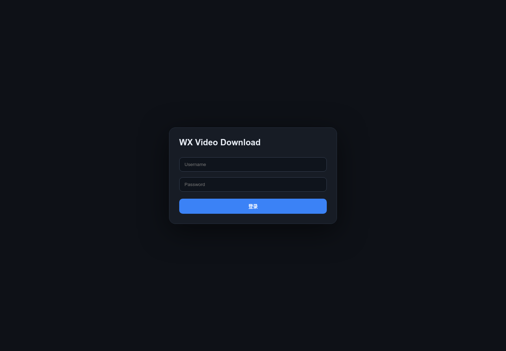
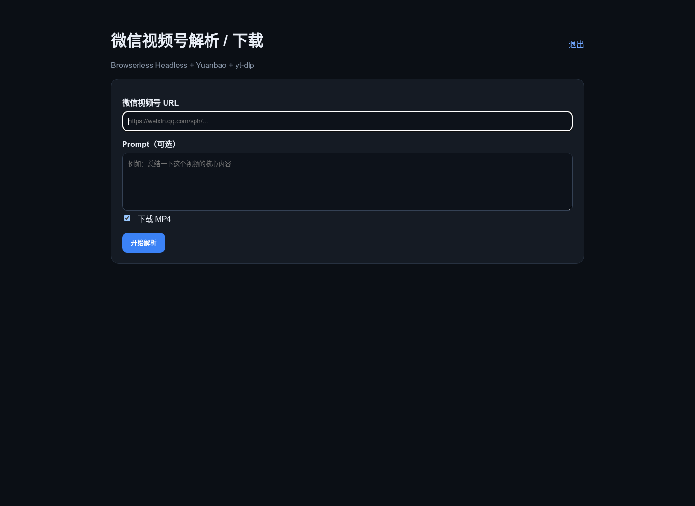
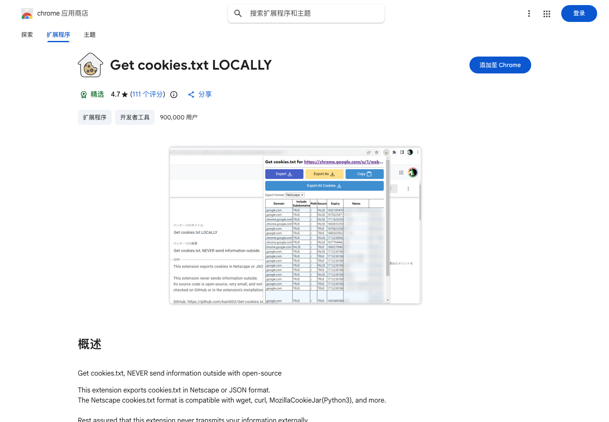

# WechatVideoDL

一个面向 **微信视频号分享链接** 的自托管解析 / 下载服务。

输入一条 `weixin.qq.com/sph/...` 链接和可选 Prompt，服务会在无头浏览器中调用腾讯元宝，让元宝理解视频内容并返回回答，同时解析视频号真实视频源，最后由 `yt-dlp` 保存 MP4，并提供 WebUI 与 HTTP API。

> 当前推荐部署方式：**Ubuntu / Debian + 现有 Docker 环境 + Docker Compose + Browserless**。  
> 项目不会要求你为了它替换 Docker，也不会主动停止其他 Compose 项目。

## 最快开始

如果你是在一台新的 Ubuntu / Debian VPS 上部署，完整流程可以概括为：

```bash
git clone https://github.com/samni728/WechatVideoDL.git
cd WechatVideoDL/server_docker

# 如果服务器完全没有 Docker，先检查/安装
./scripts/install-docker-if-missing.sh

# 创建运行目录和配置
mkdir -p data/downloads
cp .env.example .env

# 将你在 Chrome 中导出的登录态放到 data/ 目录
# data/yuanbao.tencent.com_cookies.txt
# data/yuanbao_session.json

# 先检查，不修改现有 Docker 环境
./scripts/deploy.sh --dry-run

# 正式启动
./scripts/deploy.sh
```

**没有 Browserless 也没关系。** 部署脚本会优先复用兼容的现有 Browserless；如果没有，则使用项目自带的 `docker-compose.browserless.yml` 启动一份隔离的 Browserless 无头 Chromium。普通用户不需要另外手工安装 Browserless。





---

## 功能

- 输入微信视频号短分享链接，例如 `https://weixin.qq.com/sph/...`
- 可附带 Prompt，例如“总结一下这个视频的核心内容”
- 腾讯元宝返回视频理解 / 回答文本
- 解析完整 `channels.weixin.qq.com/finder-preview/...` URL
- 解析真实 `finder.video.qq.com/...` 视频 URL
- 使用 `yt-dlp` 下载 MP4
- 自动保存元宝回复 TXT
- MP4 / TXT 使用简短序号文件名，例如：

```text
wxv_000001.mp4
wxv_000001.txt
```

- WebUI 用户名 / 密码登录
- API HTTP Basic Auth
- Browserless 无头运行，不弹桌面浏览器
- Chromium 强制静音，并阻止页面媒体流真正播放
- Docker / Compose / Browserless 安装前兼容性检测

---

## 工作原理

```text
Browser / curl
     │
     ▼
wx-video-download WebUI / API
     │
     ├── URL + 可选 Prompt
     ▼
Browserless Headless Chromium
     │
     ├── 注入 Yuanbao Cookie / Session
     ├── 打开 yuanbao.tencent.com
     ├── 发送 URL + Prompt
     ├── 等待完整回答
     └── 取得视频号 finder-preview URL
                     │
                     ▼
           WeChat Channels Preview
                     │
                     ├── 禁止 autoplay
                     ├── 静音
                     ├── abort 浏览器 media request
                     └── 取得 finder.video.qq.com 真实 URL
                                      │
                                      ▼
                                   yt-dlp
                                      │
                      ┌───────────────┴───────────────┐
                      ▼                               ▼
              wxv_000001.mp4                 wxv_000001.txt
```

这个 Docker 版本 **不依赖 Playwright SDK**。业务容器直接调用 Browserless 的 `/function` API，由 Browserless 内部的 Chromium 执行网页自动化。

---

# 一、最重要的 Docker 兼容性原则

这个项目曾经踩过一个很典型的坑：一台服务器原本由 **Snap Docker** 管理旧容器，又额外启动了一套 **Docker CE**，结果 `/run/docker.sock` 指向了另一套 daemon。执行 `docker ps` 时，看起来像“原来的 Docker 全没了”，实际上只是连接到了不同的数据目录。

因此，本项目现在遵循以下规则：

1. **如果当前 Docker 正常，绝不重新安装、升级、切换或重启 Docker。**
2. 如果 `docker` 命令存在，但 daemon / socket 不可访问，部署脚本会直接停止，**不会安装第二套 Docker**。
3. 同时兼容：
   - `docker compose`
   - `docker-compose`
4. 不执行：
   - `docker system prune`
   - `docker compose down -v`
   - 其他项目目录中的 `docker compose down`
5. 部署前记录所有运行容器；部署完成后逐个核对。原本运行的非本项目容器如果有任何一个消失，部署会判定失败。
6. 如果目标端口已经被无关容器占用，不抢端口，直接报错。

可以先只做检测，不做任何部署：

```bash
cd server_docker
./scripts/deploy.sh --dry-run
```

典型输出：

```text
Docker state      : ready
Docker server     : 29.8.0
Docker root       : /var/snap/docker/common/var-lib-docker
Docker flavor     : snap
Compose           : plugin (...)
Compose project   : wx-video-download
Application port  : 18770
DRY RUN: no container/image/service changes were made.
```

---

## Snap Docker 特别说明

Snap Docker 对 bind mount 路径有额外沙箱限制。在实际测试中，把项目放在：

```text
/opt/wx-video-download
```

会出现类似：

```text
error while creating mount source path '/opt/wx-video-download/data':
mkdir /opt/wx-video-download: read-only file system
```

这不是 Docker 数据损坏，也不应该通过安装另一套 Docker 来“修复”。

如果检测到 Snap Docker，本项目会拒绝从 `/opt/...` 部署，建议使用：

```text
/root/wx-video-download
```

或 `/home/...` 等 Snap Docker 可访问路径。

---

# 二、服务器要求

推荐：

- Ubuntu / Debian
- x86_64 / amd64 VPS
- Docker（已有版本优先）
- Docker Compose v2 或 `docker-compose`
- 建议至少 2 GB RAM
- 建议至少预留 4 GB 磁盘空间（Browserless Chrome 镜像本身较大）

应用容器内已经包含 Python、Flask、Gunicorn 和 `yt-dlp`。

当前下载流程直接保存视频号 MP4，所以 Docker 镜像**不强制安装 ffmpeg**；`ffprobe` 媒体信息属于可选增强，不影响下载本身。

---

# 三、Docker：先检测，再决定是否安装

## 1. 服务器已经有 Docker

不要重新安装。

先执行：

```bash
docker --version
docker info
docker compose version || docker-compose --version
```

再运行项目自带保护脚本：

```bash
cd server_docker
./scripts/install-docker-if-missing.sh
```

如果 Docker 正常，它只会显示当前 Docker 信息并退出：

```text
Existing Docker is healthy; reusing it.
```

### 如果 Docker CLI 存在，但 daemon 不通

脚本会停止并提示：

```text
Refusing to install a second Docker daemon.
```

这时应该修复服务器原来的 Docker / socket，而不是安装另一套 Docker。

## 2. 服务器真的完全没有 Docker

先运行：

```bash
./scripts/install-docker-if-missing.sh
```

确认输出明确表示 Docker genuinely missing。

只有这种干净主机，才显式执行：

```bash
./scripts/install-docker-if-missing.sh --install
```

自动安装仅限 Ubuntu / Debian，并使用发行版仓库的 Docker 软件包；脚本不会擅自添加 Docker CE 第三方仓库。

> 如果你有既定 Docker 运维规范，推荐自己安装 Docker，然后让本项目复用现有环境。

---

# 四、Browserless 怎么处理

Browserless 是本项目的无头 Chromium 服务。**大多数用户不需要先单独安装 Browserless**：只要 Docker / Compose 可用，项目就能在需要时自动拉取并启动 Browserless 容器。

官方文档：

- https://docs.browserless.io/overview/intro
- https://docs.browserless.io/enterprise/open-source

本项目不会简单粗暴地“发现 Browserless 就重启它”。部署脚本会检查：

1. 当前 Docker 是否已有正在运行的 `browserless/chrome`；
2. 是否对宿主机发布了 3000 对应端口；
3. 是否有 TOKEN；
4. `CONNECTION_TIMEOUT` 是否满足本项目要求（默认至少 `180000 ms`）。

### 情况 A：已有 Browserless，配置兼容

直接复用，不创建第二个，不修改它。

### 情况 B：已有 Browserless，但配置不兼容

例如现有 Browserless 给其他服务使用：

```text
CONNECTION_TIMEOUT=60000
```

而元宝一次任务可能超过 60 秒。

这时项目**不会修改或重启原来的 Browserless**。如果当前 Docker 已有可用 Browserless 镜像，则用同一个镜像为本项目启动一份独立 Browserless：

```text
wx-video-download-browserless-1
```

它：

- 不映射宿主机端口；
- 仅 `wx-video-download` Compose 内部网络可访问；
- 使用独立 TOKEN；
- `CONNECTION_TIMEOUT=300000`；
- 不影响服务器原有 Browserless。

### 情况 C：没有 Browserless 容器，但已有 Browserless 镜像

不 pull，直接复用本地镜像。

### 情况 D：连 Browserless 镜像都没有

才会拉取 `BROWSERLESS_IMAGE`。默认值是一份已实测通过的 Browserless v1 镜像 digest，而不是浮动 `latest`。

本项目的 Compose 默认已经固定到一份实测可用的 Browserless v1 镜像 digest，避免 `latest` 在未来发生不兼容变化。你也可以在 `.env` 中用 `BROWSERLESS_IMAGE` 覆盖，但更新 Browserless 前建议先做 `/function` 与超时兼容性测试。

---

# 五、获取腾讯元宝 Cookie

元宝需要登录态。推荐在你自己的 Chrome 上登录腾讯元宝，然后导出 Cookie。

## 推荐扩展：Get cookies.txt LOCALLY

Chrome Web Store：

https://chromewebstore.google.com/detail/get-cookiestxt-locally/cclelndahbckbenkjhflpdbgdldlbecc

扩展 ID：

```text
cclelndahbckbenkjhflpdbgdldlbecc
```



安装完成后，这个扩展会出现在 Chrome 扩展列表中。它的作用就是**把当前站点 Cookie 导出到本机**，不需要把登录信息上传到第三方服务器。它支持导出 Netscape `cookies.txt` 格式，本项目可以直接读取这种格式。

> Cookie 等同于登录凭据。只在自己的设备上导出，不要把 Cookie 发给陌生服务，不要提交到 GitHub。

## Cookie 导出步骤

1. 在 Chrome 安装 **Get cookies.txt LOCALLY**。
2. 打开：

```text
https://yuanbao.tencent.com/
```

3. 正常使用微信扫码 / 账号登录元宝。
4. 确认页面已经可以正常对话。
5. 点击 Chrome 扩展中的 **Get cookies.txt LOCALLY**。
6. 只导出当前 Yuanbao 站点 Cookie，格式选择 **Netscape / cookies.txt**。
7. 将文件命名为：

```text
yuanbao.tencent.com_cookies.txt
```

8. 上传到服务器后，必须放在 **`server_docker/data/`** 下面。最终路径应为：

```text
WechatVideoDL/server_docker/data/yuanbao.tencent.com_cookies.txt
```

如果你已经进入 `server_docker` 目录，那么相对路径就是：

```text
data/yuanbao.tencent.com_cookies.txt
```

9. 设置权限：

```bash
chmod 600 data/yuanbao.tencent.com_cookies.txt
```

检查文件第一行通常类似：

```text
# Netscape HTTP Cookie File
```

本项目 `.gitignore` 已忽略 `*_cookies.txt`。

---

# 六、为什么还需要 yuanbao_session.json

实际测试发现：腾讯元宝的登录状态并不一定只依赖 Cookie；浏览器的 `localStorage` / `sessionStorage` / UA 等状态也可能参与登录会话。

因此推荐同时导出：

```text
data/yuanbao_session.json
```

## 导出方法

在已经登录元宝的 Chrome 页面按 `F12` / `Option + Command + I` 打开 DevTools，进入 Console。

确认脚本内容后执行：

```javascript
(() => {
  const dumpStorage = (storage) => {
    const out = {};
    for (let i = 0; i < storage.length; i++) {
      const key = storage.key(i);
      out[key] = storage.getItem(key);
    }
    return out;
  };

  const state = {
    ua: navigator.userAgent,
    platform: navigator.platform,
    language: navigator.language,
    cookie: document.cookie,
    localStorage: dumpStorage(localStorage),
    sessionStorage: dumpStorage(sessionStorage),
  };

  copy(JSON.stringify(state, null, 2));
  console.log('Yuanbao session JSON copied to clipboard.');
})();
```

然后把剪贴板内容保存为：

```text
yuanbao_session.json
```

上传到服务器：

```text
data/yuanbao_session.json
```

并设置：

```bash
chmod 600 data/yuanbao_session.json
```

> DevTools 可能提示不要粘贴不理解的代码。上面的脚本只读取当前 Yuanbao 页面自身的浏览器状态并复制到本地剪贴板；请自行检查后再执行。

本项目 `.gitignore` 已忽略 `*_session.json` 和 `server_docker/data/`。

---

# 七、Docker 部署

以下命令假设你已经把仓库放到服务器。

## 1. 进入 Docker 项目目录

```bash
git clone https://github.com/samni728/WechatVideoDL.git
cd WechatVideoDL/server_docker
```

如果 VPS 使用 Snap Docker，建议把整个项目放在：

```text
/root/wx-video-download
```

而不是 `/opt`。

## 2. 创建运行目录

```bash
mkdir -p data/downloads
```

放入：

```text
data/yuanbao.tencent.com_cookies.txt
data/yuanbao_session.json
```

## 3. 创建配置

```bash
cp .env.example .env
```

生成随机密钥：

```bash
openssl rand -hex 24
openssl rand -hex 32
```

编辑 `.env`：

```dotenv
APP_PORT=18770
WEBUI_USERNAME=admin
WEBUI_PASSWORD=请设置强密码
SECRET_KEY=请设置随机值
BROWSERLESS_TOKEN=请设置随机值
PUBLIC_BASE_URL=http://SERVER_IP:18770
```

通常**不要手工设置 `BROWSERLESS_URL`**，让 `deploy.sh` 自动检测最安全。

## 4. 先 dry-run

```bash
./scripts/deploy.sh --dry-run
```

确认它识别的是你服务器当前真正使用的 Docker daemon、DockerRootDir 与 Compose。

## 5. 正式部署

```bash
./scripts/deploy.sh
```

脚本会保存部署前基线到：

```text
.deploy-baseline/YYYYMMDD-HHMMSS/
```

并在部署后确认原有容器仍然运行。

## 6. 查看状态

```bash
docker compose -p wx-video-download \
  -f docker-compose.yml \
  -f docker-compose.browserless.yml ps
```

如果使用的是兼容的外部 Browserless，实际部署只会启动 app 容器。

---

# 八、WebUI

访问：

```text
http://SERVER_IP:18770/
```

登录后可以直接输入：

- 视频号 URL
- Prompt（可选）
- 是否下载 MP4

然后查看元宝回答并下载 MP4 / TXT。


---

# 九、HTTP API

API 与 WebUI 共用账号密码，使用 HTTP Basic Auth。

## URL + Prompt + 下载视频

```bash
curl -u 'USERNAME:PASSWORD' \
  -X POST 'http://SERVER_IP:18770/api/parse' \
  -H 'Content-Type: application/json' \
  -d '{
    "url": "https://weixin.qq.com/sph/AUjYMH2y1I",
    "prompt": "总结一下这个视频的核心内容",
    "download": true
  }'
```

## 只解析，不保存 MP4

```bash
curl -u 'USERNAME:PASSWORD' \
  -X POST 'http://SERVER_IP:18770/api/parse' \
  -H 'Content-Type: application/json' \
  -d '{
    "url": "https://weixin.qq.com/sph/AUjYMH2y1I",
    "prompt": "总结一下这个视频的核心内容",
    "download": false
  }'
```

## 成功返回示例

```json
{
  "ok": true,
  "id": "wxv_000007",
  "input_url": "https://weixin.qq.com/sph/...",
  "prompt": "总结一下这个视频的核心内容",
  "content": "元宝返回内容...",
  "yuanbao": {
    "preview_url": "https://channels.weixin.qq.com/finder-preview/pages/feed?..."
  },
  "text": {
    "filename": "wxv_000007.txt",
    "download_url": "http://SERVER_IP:18770/files/wxv_000007.txt"
  },
  "video": {
    "source_direct_url": "https://finder.video.qq.com/...",
    "downloaded": true,
    "filename": "wxv_000007.mp4",
    "download_url": "http://SERVER_IP:18770/files/wxv_000007.mp4"
  }
}
```

`source_direct_url` 通常带时效；长期使用应优先保存服务返回的本地 `download_url`。

---

# 十、健康检查与日志

## Health

```bash
curl http://SERVER_IP:18770/health
```

正常返回：

```json
{
  "ok": true,
  "browserless": true,
  "cookie_file": true
}
```

## App 日志

```bash
docker logs -f wx-video-download-app-1
```

## 项目内部 Browserless 日志

```bash
docker logs -f wx-video-download-browserless-1
```

如果脚本复用了服务器原有 Browserless，则容器名取决于你的现有环境。

---

# 十一、为什么不会在后台突然播放声音

视频号页面只负责拿真实视频 URL，不负责真正播放视频。

Browserless 运行 Chromium 时采用多层保护：

1. Headless Chrome；
2. 覆盖 `HTMLMediaElement.play()`；
3. 强制 `muted=true` / `volume=0`；
4. preview URL 添加 `no_autoplay=1`；
5. 浏览器网络层拦截 `resourceType === "media"` 并 `abort()`。

最后真正的视频字节由 `yt-dlp` 从 `finder.video.qq.com` 下载。

---

# 十二、安全建议

以下内容都**不要提交到 GitHub**：

```text
.env
data/
yuanbao.tencent.com_cookies.txt
yuanbao_session.json
downloads/
.deploy-baseline/
```

这些路径已经加入 `.gitignore`，但推送前仍建议检查：

```bash
git status --short
git ls-files | grep -E '(cookies|session|\.env$|downloads/)'
```

如果 Cookie、Session、WebUI 密码或 Browserless TOKEN 曾经提交到公开仓库，应立即更换对应凭据，而不是只删除 GitHub 上的最新文件。

另外，如果 WebUI 暴露到公网，建议在前面增加 HTTPS 反向代理，并限制来源 IP / VPN / ZeroTier / Tailscale 等访问范围。

---

# 十三、常见故障

## `docker ps` 突然看不到以前的容器

先不要重建容器，更不要 prune。

检查：

```bash
docker info --format 'Root={{.DockerRootDir}} Server={{.ServerVersion}}'
ls -l /run/docker.sock
systemctl status docker --no-pager
systemctl status snap.docker.dockerd --no-pager
```

如果同一台服务器同时存在 Snap Docker 与 Docker CE，很可能只是当前 CLI/socket 连到了另一套 daemon。

## Snap Docker 报 `/opt/... read-only file system`

把项目迁到 `/root/...` 或 `/home/...`，不要为了绕过这个问题安装第二套 Docker。

## Browserless `/function` 约 60 秒后断开

检查：

```bash
docker inspect browserless \
  --format '{{range .Config.Env}}{{println .}}{{end}}' | grep CONNECTION_TIMEOUT
```

本项目需要更长任务窗口。`deploy.sh` 会检查已有 Browserless；不兼容时不会修改它，而是启动项目隔离实例。

## 元宝提示登录失效

重新在 Chrome 登录 Yuanbao，然后更新：

```text
data/yuanbao.tencent.com_cookies.txt
data/yuanbao_session.json
```

然后只重启本项目：

```bash
docker restart wx-video-download-app-1
```

无需重启 Docker daemon。

## 端口冲突

修改 `.env`：

```dotenv
APP_PORT=18771
PUBLIC_BASE_URL=http://SERVER_IP:18771
```

再运行：

```bash
./scripts/deploy.sh
```

脚本不会抢占其他容器正在使用的端口。

---

# 十四、本地 OpenCLI 版本

仓库根目录仍保留最初的 macOS / OpenCLI 版本：

```text
app.py
run.sh
scripts/bootstrap.sh
scripts/yuanbao-login.sh
```

它适合本机调试，OpenCLI 在后台控制 Chrome。

服务器长期运行推荐使用：

```text
server_docker/
```

即 Browserless 无头 Docker 版本。

---

## 已验证的部署行为

当前实现已经实际验证过以下场景：

- 识别并复用现有 Snap Docker daemon；
- Docker CE 存在但处于 inactive / masked 时不触碰它；
- 部署前后的原有容器全部保持运行；
- Snap Docker `/opt` bind mount 不兼容时安全停止并迁移项目目录；
- 已有 Browserless 超时不足时不修改原容器；
- 复用已有 Browserless 镜像建立隔离实例；
- URL + Prompt → Yuanbao → finder-preview → 真实视频 URL → yt-dlp 完整链路成功；
- MP4 / TXT 下载接口成功；
- WebUI 未登录跳转登录页、API 未授权返回 401。

---

## Disclaimer

本项目用于处理你有权访问和保存的内容。请遵守微信视频号、腾讯元宝及相关网站的服务条款、版权规定和当地法律。登录 Cookie / Session 只应在你自己的账号和设备上使用。
